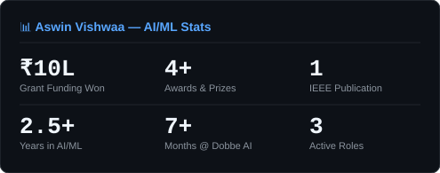
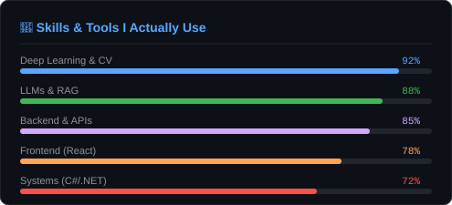

  

<h1 align="center">Hey, I'm Aswin Vishwaa 👋</h1>

  <b>AI/ML Engineer · Backend Developer · Medical AI Researcher</b> 
  Building things that actually work — from deep learning pipelines to production systems.

  
  
  
  

---

## 🙋 Who am I?

I'm a **B.Tech AI/ML Engineering student** who codes like a professional and thinks like a builder.

I didn't start with a grand plan. I just followed curiosity — from NCC camps to computer vision, from a movie recommender to winning a **₹10 Lakh national grant at IIM Calcutta**.

Right now I work as a **Software Engineer at Dobbe AI** (building medical imaging backend systems) and simultaneously **freelancing on an AI brain tumor radiotherapy pipeline** — both running in parallel. That's my pace.

I learn by shipping. I optimise after it works. Chaos first, clarity later.

---

## 🏆 Highlights

| | |
|---|---|
| 🏆 | **₹10 Lakh grant** — Titan Nest National Program, IIM Calcutta (Oct 2025) |
| 🥇 | **1st Prize + ₹30K** — Startup Mania 9.0 (Dec 2024) |
| 📄 | **Research Paper** — ICCCNT 2025, IEEE @ IIT Indore |
| 🎖️ | **NCC Air Wing** — National camps, leadership training |

All three wins came from the same project: **Glaucoma Detection AI** — a portable screening device built with UNet + YOLOv9.

---

## 🔨 What I'm building right now

- 🏥 **At Dobbe AI** — FastAPI backend refactor, medical imaging agent (C#/.NET MSI), Wazuh security monitoring
- 🧬 **Freelance** — AI Brain Tumor Radiotherapy Pipeline: 3D UNet + MedGemma 1.5 + LangChain RAG + GPU-accelerated RT contouring on dual T4s

---

## 🤙 A few real things about me

- 🧠 I build to understand. I don't read theory first — I jump in and figure it out
- ⚡ I've built projects from scratch in 2 days. Never used Docker before? Cool, learned it overnight
- ♟️ 650 Elo on chess.com — yes I'm bad, no I don't care
- 🌏 Goal: travel everywhere
- 🐛 Clearing errors since 2022

---

## 📊 Stats

  
  

---

### ✍️ Random Dev Quote

---

  <i>If it works, it ships. I'll clean it later.</i>

